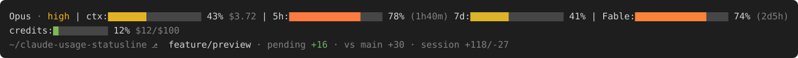

# claude-usage-statusline

The plan-user sibling of
[claude-spend-statusline](https://github.com/MasonFlint44/claude-spend-statusline):
5-hour, 7-day and Fable window bars, the compaction point, and a fitter that
learns how the windows charge for each kind of token.



## Status

Interim release (0.1.x). `statusline/usage-statusline.sh` is the author's
home statusline script as of 2026-09-07, packaged with an install skill so it
can be used before the port described in
[`docs/plans/01-plan-limit-fitting.md`](docs/plans/01-plan-limit-fitting.md).
The compaction point and the fitter are not built yet.

It shows the model, effort, context and session cost, the 5-hour and 7-day
usage bars, the Fable weekly bar, an overage `credits:` line while spend is
above zero, and a git location row.

## Requirements

- Linux, WSL or Git Bash on Windows. macOS is not supported yet.
- `jq`; `curl` for the Fable bar; `git` for the location row.
- A Pro or Max plan, signed in with a Claude account (not an API key).

## Install

As a plugin, from the
[claude-toolbox](https://github.com/MasonFlint44/claude-toolbox) marketplace:

```
/plugin marketplace add MasonFlint44/claude-toolbox
/plugin install usage-statusline@claude-toolbox
/usage-statusline:install
```

By hand: copy `statusline/usage-statusline.sh` to `~/.claude/statusline/`,
make it executable, and add to `~/.claude/settings.json`:

```json
"statusLine": { "type": "command", "command": "bash \"${CLAUDE_CONFIG_DIR:-$HOME/.claude}/statusline/usage-statusline.sh\"" }
```

Claude Code runs the command through a shell, so the path is resolved where
it runs: a `~/.claude` mounted into a devcontainer under another user's home
works from the same settings file. Install `jq` and `curl` in the container
too.

## Privacy

The Fable bar reads your Claude Code OAuth token from
`.credentials.json` in your Claude config directory and calls `api.anthropic.com/api/oauth/usage`,
the same undocumented endpoint the `/usage` page uses. The token is passed to
`curl` on stdin, never on the command line. Results are cached in
`cache/statusline/plan-usage` in the same directory. Nothing else leaves your machine.

## Development

`docs/preview.py` regenerates the preview above from the script itself
(python3, git and jq). Run it after any change to what the script draws.
